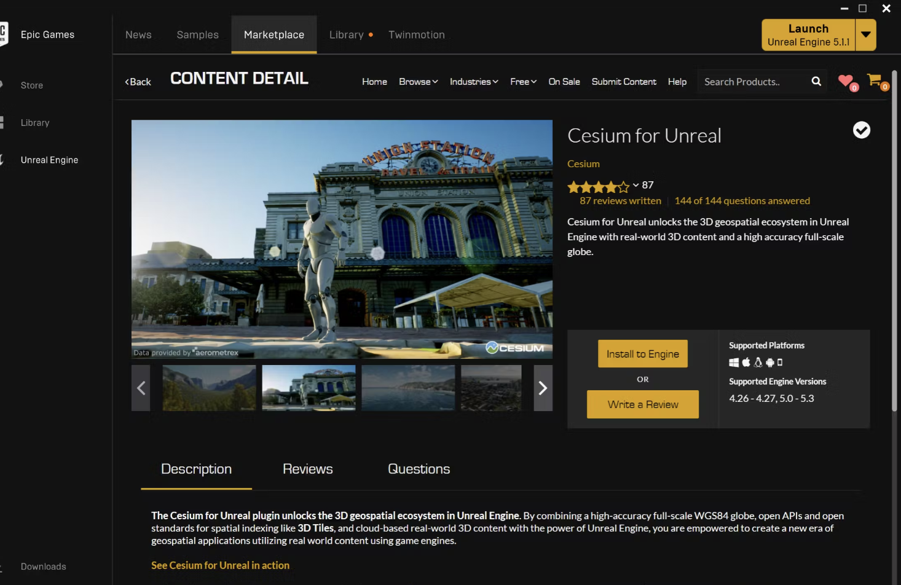
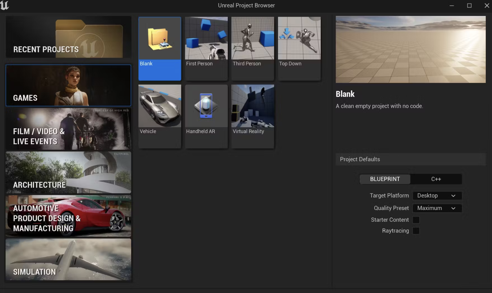
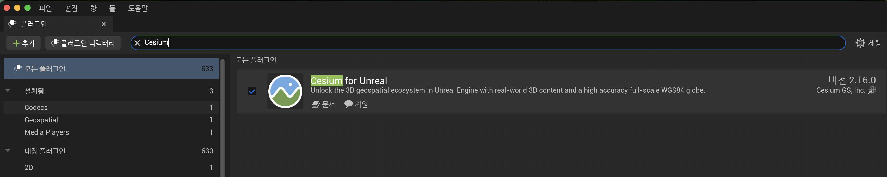
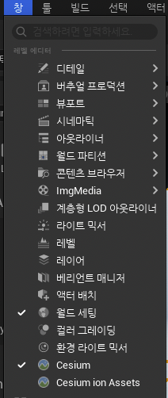
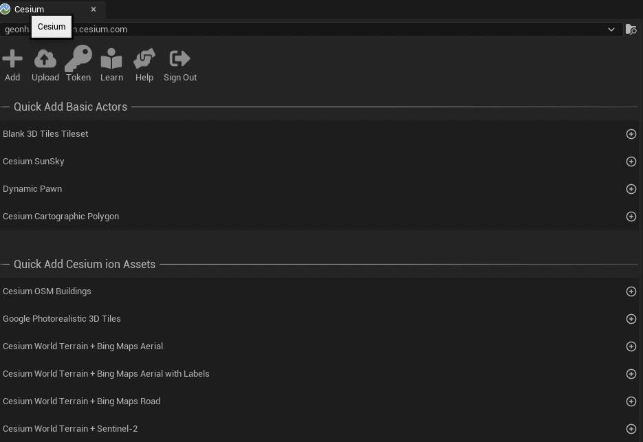
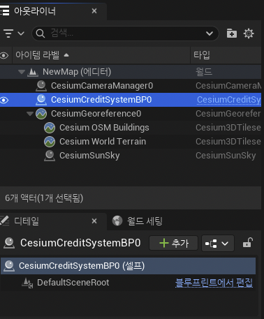
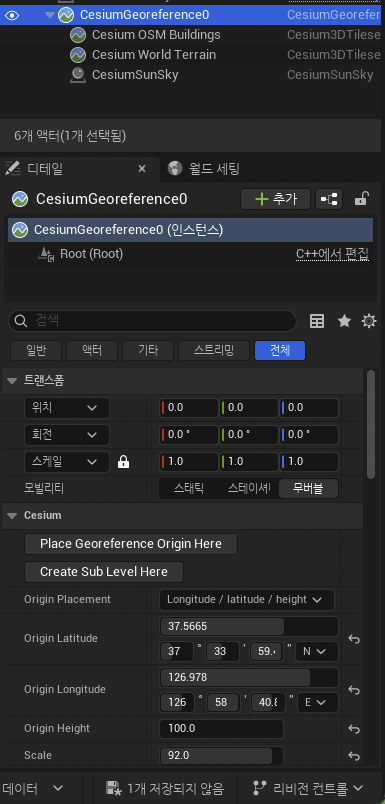

# Cesium for Unreal Quickstart

# Step 1: Install the Cesium for Unreal plugin

1. Open the [Cesium for Unreal plugin page](https://cesium.com/unreal-marketplace/) on the Unreal Engine Marketplace.

2. click the **Install to Engine** button to add the plugin to your Unreal Engine installation.

# Step2:  Create a Cesium for Unreal project

1. Select **Game** as the New Project Category and **Blank** as the Template.

2. Open the **Plugins** window (Edit -> Plugins) and search for “Cesium” in the search bar at the top of the Plugins window.

3. Open the Cesium panel by clicking Window

4.  Token Click -> new token or existing token
5. Cesium SunSky, Cesium World Terrain + Bing Maps Aerial, OSM Buildings -> + click

6. right panel  : **Outliner** -> CesiumCreditSystemBP0 Click

7. Select the **CesiumGeoreference** actor in the **Outliner**.
8. In the **Details** panel, look for the **Origin Latitude**, **Origin Longitude**, and **Origin Height** variables under the Cesium category.
